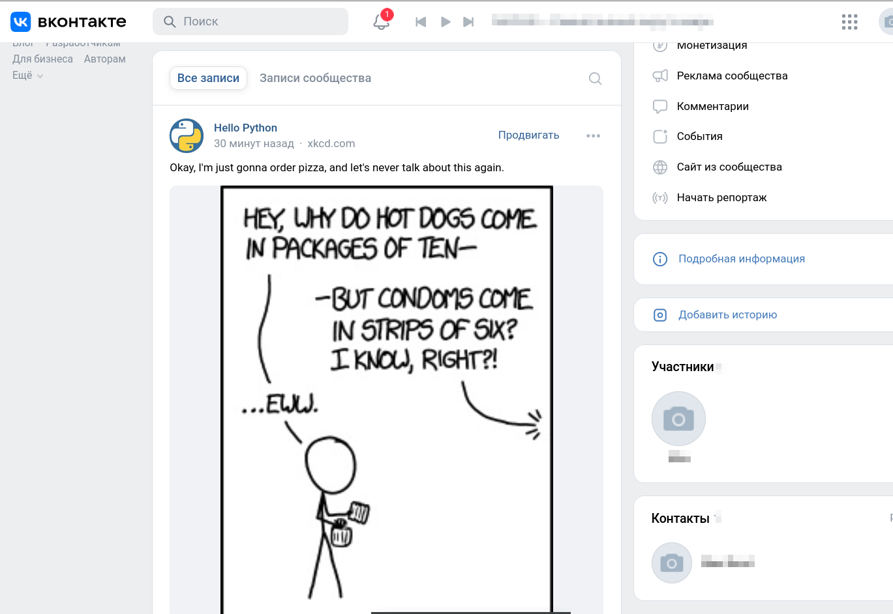

# Скрипт для публикации комиксов про Python в вашем сообществе в контакте

**Предметная область**

Скрипт производит загрузку комикса с сайта https://xkcd.com/ в случайном порядке и публикует его в ВК



**Переменные окружения**

Настройки скрипта **comics.py** берётся из переменных окружения.
Создайте файл `.env` и запишите туда данные в формате: `ПЕРЕМЕННАЯ=значение`.
Доступны 3 переменные:
- `VK_CLIENT_ID=` 
- `ACCESS_TOKEN=` 
- `GROUP_ID=` 

**Для запуска сайта вам понадобится Python третьей версии**

- Скачайте код с GitHub.
- Установите зависимости командой `pip install -r requirements.txt`
- Создайте файл окружения .env и пропишите в него свои даные

**Запустите скрипт**
```sh
python3 comics.py
```

#### Автор
**Zatomis** - *Цель проекта* - Код написан в образовательных целях на онлайн-курсе для веб-разработчиков [Devman](https://dvmn.org)